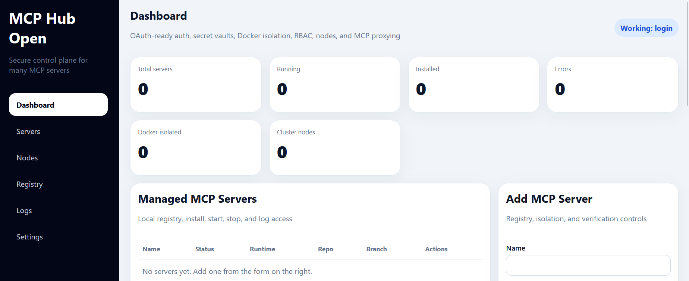
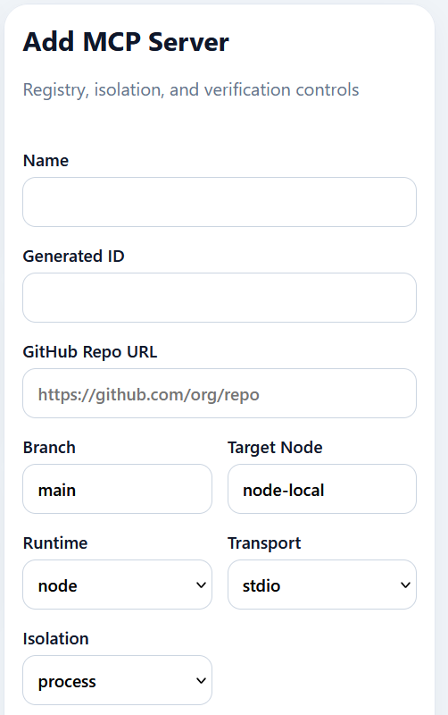

# MCP Hub Open


Open-source MCP Hub for installing, configuring, securing, and managing MCP servers from one central interface.

> **Project Status:** Early MVP / alpha  
> This project is functional for testing and community contribution, but it is not yet production-hardened. Expect active changes to APIs, configuration, storage, and security features as the project evolves.

MCP Hub Open is an open-source control plane for managing many MCP servers from one place.

It is designed to help teams:
- register MCP servers
- pull server source from GitHub
- encrypt and store configuration secrets
- start and stop local MCP servers
- run isolated workloads in Docker
- apply role-based access control
- register multiple execution nodes
- proxy MCP JSON-RPC requests through one API
- verify packages with checksums or detached signatures
- expose a web UI for testing and operations

## Screenshots

### Dashboard


### Add Server Wizard


## What this repo is

This repo is a working starter kit for community testing and contribution.

It includes:
- Fastify + TypeScript API
- React + Vite frontend
- JSON file persistence for easy local setup
- Git clone/pull support
- local process supervision
- encrypted secret vaults using AES-256-GCM
- local auth, JWT sessions, and RBAC
- optional OIDC/OAuth login wiring
- Docker isolation mode for install/build/run
- basic multi-node registry and heartbeats
- experimental MCP JSON-RPC proxy route
- checksum and detached-signature verification hooks

## Included security and platform features

### OAuth / SSO
- local login is enabled by default for easy testing
- OIDC/OAuth sign-in endpoints are included and can be enabled with environment variables
- JWT bearer tokens protect the API when `REQUIRE_AUTH=true`

### Encrypted secret vaults
- secret environment variables are encrypted at rest before they are written to `runtime/data/servers.json`
- decrypted values are only used when commands are executed or proxied

### Docker isolation
- each server can run with `isolation.mode = "docker"`
- install, build, and start commands can be executed in a container instead of directly on the host

### RBAC
- built-in roles: `admin`, `operator`, `viewer`
- admin can manage users and everything else
- operator can manage servers and nodes
- viewer has read-only access

### Multi-node orchestration
- cluster nodes can be registered and heartbeats tracked
- each managed server can be assigned to a `targetNodeId`
- the local API will refuse to run a server assigned to a different node

### Full MCP protocol proxying
- `POST /api/servers/:id/mcp` forwards JSON-RPC payloads to:
  - remote MCP servers over HTTP
  - local stdio MCP servers that are currently running
- requests carry an `X-MCP-Session-Id` header; the hub maintains per-session metadata (serverId, timestamps, request count)
- caller identity (`X-MCP-Caller-Role`, `X-MCP-Caller-Email`) is forwarded to upstream MCP servers for traceability
- `GET /api/sessions` lists all active proxy sessions (admin/operator)
- `DELETE /api/sessions/:sessionId` clears a session (admin)

### Signed package verification
- checksum verification mode validates a target file with SHA-256
- signature verification mode validates a detached signature over a manifest using a PEM public key

## Architecture

```text
apps/
  api/   -> Fastify backend, auth, vault, registry, git installer, process manager, MCP proxy
  web/   -> React UI for server management
runtime/
  data/      -> server registry JSON, users, nodes
  repos/     -> cloned MCP repos
  logs/      -> log files per server
```

## Quick start

### 1. Install

```bash
npm install
```

### 2. Copy env file

```bash
cp .env.example .env
```

### 3. Start both API and web UI

```bash
npm run dev
```

### 4. Open the UI

The frontend runs over **HTTPS** using a self-signed certificate provided by `@vitejs/plugin-basic-ssl`. Your browser will show a certificate warning on first visit — click through to accept it for local development.

Frontend:

```text
https://localhost:5173
```

API (HTTP only in dev):

```text
http://localhost:4010
```

> **Note:** The API itself runs over plain HTTP in development. The Vite dev server proxies `/api` requests from the HTTPS frontend to the local API, so you do not need to configure TLS on the API for local use. For production deployments, place both services behind a reverse proxy (e.g. nginx or Caddy) that terminates TLS and forwards to each app.

## Web UI navigation

The sidebar provides access to five pages:

| Page | Description |
|------|-------------|
| **Dashboard** | Overview stats — total servers, running, installed, errors, Docker-isolated, and cluster node count |
| **Servers** | Register, install, start, stop, and configure MCP servers |
| **Nodes** | View registered cluster nodes and their heartbeat status |
| **Logs** | Stream runtime output for a selected server |
| **Settings** | View active environment configuration (auth status, signed-in role, API URL, local node ID) |

The current page is highlighted in the sidebar. Auth status and the signed-in role are shown at the bottom of the sidebar.

## Default local login

When auth is enabled, the default dev login comes from `.env.example`:

```text
admin@example.com
admin123!
```

Change this before publishing a real deployment.

## Environment variables

Key examples:
- `REQUIRE_AUTH=true`
- `JWT_SECRET=change-me`
- `VAULT_MASTER_KEY=change-me`
- `LOCAL_NODE_ID=node-local`
- `OIDC_ISSUER=https://your-idp.example.com`
- `OIDC_CLIENT_ID=...`
- `OIDC_CLIENT_SECRET=...`
- `OIDC_REDIRECT_URI=http://localhost:4010/api/auth/oidc/callback`

## Example workflow

1. Sign in to the dashboard
2. Click **Add server**
3. Paste a GitHub repo URL
4. Choose runtime, transport, target node, and isolation mode
5. Add encrypted environment variables
6. Optionally add checksum or signature verification
7. Save the server definition
8. Click **Install** to clone or pull the repo
9. Click **Start** to run it locally or in Docker
10. Use the MCP proxy endpoint to test JSON-RPC calls

## API highlights

### Auth
- `POST /api/auth/login`
- `GET /api/auth/providers`
- `GET /api/auth/oidc/start`
- `GET /api/auth/oidc/callback`

### Users / RBAC
- `GET /api/users`
- `POST /api/users`

### Nodes
- `GET /api/nodes`
- `POST /api/nodes/register`
- `POST /api/nodes/:id/heartbeat`

### Servers
- `GET /api/servers`
- `POST /api/servers`
- `PUT /api/servers/:id`
- `POST /api/servers/:id/install`
- `POST /api/servers/:id/start`
- `POST /api/servers/:id/stop`
- `GET /api/servers/:id/logs`
- `POST /api/servers/:id/mcp`

## Security notes

This project can execute commands and containers on the local machine.

Use it only in a trusted development environment until you harden it for your organization.

Recommended next steps:
- validate OIDC ID tokens and issuer keys
- move users, nodes, and server registry into a database
- replace local encrypted secrets with a managed vault
- add signed release workflows in CI
- stream MCP proxy traffic with session-aware transports (implemented: `X-MCP-Session-Id` header tracking, per-session metadata, caller identity forwarding)
- add agent/worker processes for real remote node execution
- add audit trails and approval workflows

## Suggested roadmap

### Phase 1
- [x] Dashboard
- [x] Local registry
- [x] Git clone/pull
- [x] Start/stop local processes
- [x] Logs
- [x] Basic health metadata
- [x] Secret encryption
- [x] Local auth + RBAC

### Phase 2
- [x] Docker runner
- [x] Node registry + heartbeats
- [x] Experimental MCP proxy endpoint
- [x] Checksum/signature verification hooks
- [ ] remote agent process for true multi-node execution
- [x] validated OIDC token verification
- [x] session-aware streaming proxy

### Phase 3
- [ ] approval workflows
- [ ] audit trails
- [ ] policy engine
- [ ] managed secret backends
- [ ] clustered job scheduling
- [ ] enterprise packaging and signed releases

## Contributing

See [CONTRIBUTING.md](./CONTRIBUTING.md).

## License

MIT
